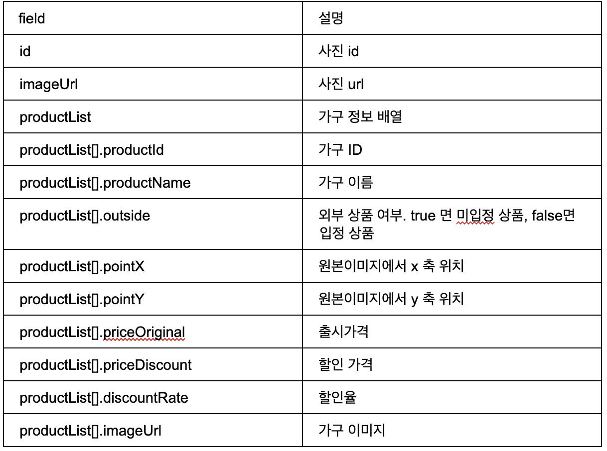

# 🏩집꾸미기 상품 정보 컴포넌트 만들기🎀

## 배포링크

## 프로젝트 소개

* 집꾸미기의 집소개 기능 중 사진과 가구 정보를 조합하는 컴포넌트 구현하기

## 기능 명세

- [x] API 호출을 통해 상품 정보 불러와 저장
  * api response

> 
>
> 

- [x] 가구 정보가 있는 곳에 돋보기 버튼 표시
  - [x] 버튼 및 툴팁 위치 잡기
  - [x] 돋보기 클릭 시 -> 툴팁 출력 돋보기 버튼은 닫기 버튼으로 변경
  - [x] 툴팁은 1개만 노출 가능 -> 다른 가구 선택 시 노출되고 있던 툴팁 닫히고 새로 선택한 가구 툴팁 출력
  - [x] 닫기 버튼 클릭 시 -> 툴팁 사라지고 돋보기 버튼으로 변경
  - [x] 위치에 따라 툴팁 말풍선 모양 변경, 위 / 아래 위치 변경
  - [x] 가격 1000단위 컴마 출력
- [x] 하단 상품 목록
  - [x] 스크롤바 
  - [x] 가구 선택 시 해당 툴팁 출력
  - [x] 선택된 가구는 아웃라인으로 표시
  - [x] 할인율이 존재하는 상품의 경우 상단에 할인율 표시
- [x] 툴팁에 상품 정보 표시 형식
  1. 입점된 상품(`outside가 false인 경우`) : 상품 이미지 / 상품명 / 할인율 / 가격 
  2. 입점되지 않은 상품(`outside가 true인 경우`) : 상품 이미지 / 상품명 / 예상 가격
